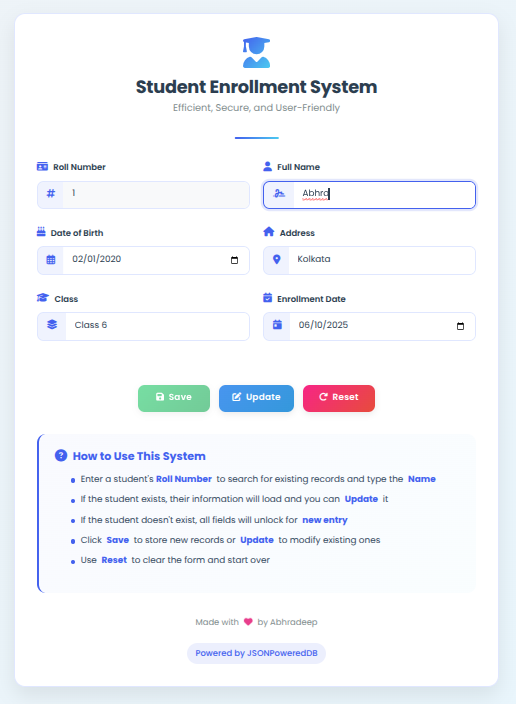

# 🎓 Student Enrollment System

## 📘 Description
The **Student Enrollment System** is a lightweight, web-based application that enables educational institutions to manage student enrollment records using **JsonPowerDB (JPDB)**. This project showcases how JPDB can be leveraged to perform fast and efficient CRUD operations with minimal backend configuration.

The system allows users to:
- Add new student records
- Update existing student information

All data is securely stored and retrieved using JsonPowerDB’s REST API.

---

## 📑 Table of Contents
- [Description](#-description)
- [Benefits of using JsonPowerDB](#-benefits-of-using-jsonpowerdb)
- [Scope of Functionalities](#-scope-of-functionalities)
- [Illustrations](#-illustrations)
- [Examples of Use](#-examples-of-use)
- [Release History](#-release-history)
- [Project Status](#-project-status)
- [Sources](#-sources)
- [Other Information](#-other-information)

---

## ✅ Benefits of using JsonPowerDB

- 🚀 **Super-fast CRUD Operations**  
  Read, write, update, and delete records instantly via REST APIs.

- ⚙️ **Serverless Simplicity**  
  No database installation required. All logic is built using JavaScript and API calls.

- 🧩 **Multi-Model Support**  
  Supports Document, Key-Value, and RDBMS-like table formats.

- 🔐 **Secure API Access**  
  Access is controlled using token-based authentication.

- 💡 **Developer Friendly**  
  Extremely low learning curve; ideal for student projects and rapid prototyping.

---

## 🛠️ Scope of Functionalities

- Student registration with validation
- Search student by roll number
- Update existing student details
- Delete student record
- Display student info in real-time
- Form reset functionality
- User-friendly interface using HTML/CSS
- Backend operations handled via JavaScript + JPDB REST API

---

## 🖼️ Illustrations

> 📌 UI Overview:




---

## 🧪 Examples of Use

### ➕ Add Student Record
```json
{
  "token": "your_jpdb_token",
  "dbName": "studentDB",
  "cmd": "PUT",
  "rel": "studentData",
  "jsonStr": {
    "rollNo": "101",
    "name": "Amit Roy",
    "class": "10",
    "dob": "2008-04-21",
    "address": "Kolkata",
    "enrollmentDate": "2024-06-10"
  }
}
```

### 🔍 Get Student Record
```json
{
  "token": "your_jpdb_token",
  "dbName": "studentDB",
  "cmd": "GET_BY_KEY",
  "rel": "studentData",
  "jsonStr": {
    "rollNo": "101"
  }
}

```

## 📦 Release History

- **v1.0.0** – 🎉 Initial Release with student registration form and basic CRUD using JsonPowerDB  


---

## 📌 Project Status

✅ **Completed & Fully Functional**

This project is complete and ideal for academic submissions or small institutional use cases. Planned future upgrades include:

- 🔐 Admin login system  
- 📊 Data pagination and filtering  
- 📁 Export student data to Excel or PDF  

---

## 📚 Sources

- 🔗 [JsonPowerDB Official Documentation](https://login2explore.com/jpdb/docs.html)  
- 🔗 [JPDB REST API Reference](https://login2explore.com/jpdb/api/index.html)  
- 🔗 [Form Validation - MDN Docs](https://developer.mozilla.org/en-US/docs/Learn/Forms/Form_validation)  

---

## ℹ️ Other Information

- 💻 Built using **HTML**, **CSS**, and **Vanilla JavaScript**  
- 🔌 Backendless system powered by **JsonPowerDB REST API**  

---

> 💬 For suggestions, improvements, or queries—feel free to connect at hello@abhradeep.com


